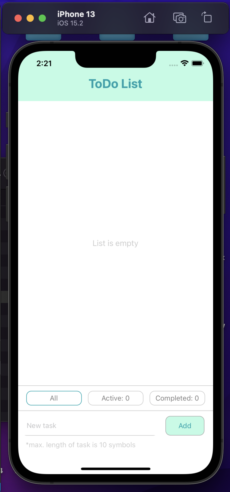
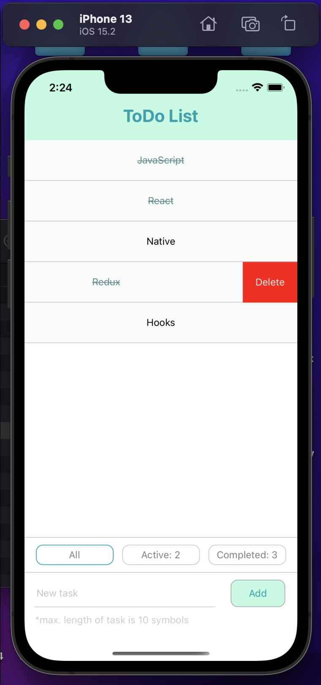

# Тестовое задание 
## Todo List
## React-native + Redux
---

## Задание:

Создать компонент соответствующий нижеуказанным требованиям.Наличие файлика readme с инструкциями по запуску является плюсом.Технология - React-Native. Отсутствие Expo в проекте является очень большим плюсом.
Достаточно сделать запускаемым по крайней мере одну ОС (Android или iOS).

1-ая сложность:
- Добавление новой записи;
- Отображение списка добавленных записей;
- Удаление из списка добавленных записей.

2-ая сложность:
- (Все пункты с предыдущего уровня сложности)
- Новая запись добавляется при условии, что длина записи меньше некоторого N;
- Переключение статуса записи Выполнено / Невыполненный при клике на её название.

3-ая сложность:
- (Все пункты с предыдущего уровня сложности)
- Фильтрация по типу (все, выполненные, невыполненные);
- Отображение счётчика выполненных и невыполненных задач.

4-ая сложность:
- (Все пункты с предыдущего уровня сложности)
- Использование хранилища (Redux).
---
## Результат:
<div style="display:flex;">


</div>


## Инструкция по запуску на macOS:

### Клононируем репозиторий на компьютер:
```
git clone https://github.com/wfrsnk/react-native-todo.git
```
### Переходим в корень проекта:
```
cd react-native-todo/todo
```
Если окружение не настроено, тут показано как это сделать:
https://www.jscamp.app/ru/docs/reactnative15/

### Восстанавливаем зависимости:
```
npm i
```
### Запускаем приложение:
```
npx react-native start
```
### Открываем новый терминал и так же, из корня проекта, запускаем симулятор и сборку:
```
npx react-native run-ios
```
